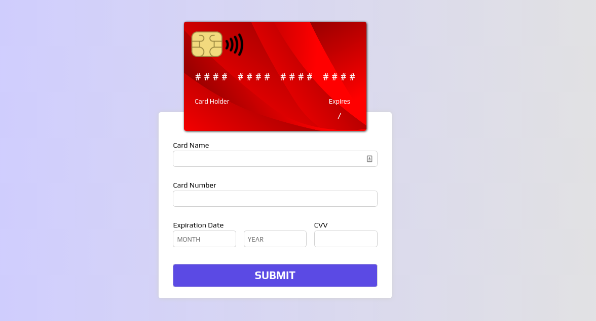

# <a href="https://jseguraweb.github.io/credit-card/">Credit card</a>

> HTML, CSS, Vanilla-JS Project: create a form to insert a credit card's information

> Only desktop-view

> ## Details:

- It's about practicing. The intended user and the client is going to be me. 
- Goal: include it in my portfolio.

> ## Priorities:

1. Start a Repository on GitHub
2. Create a Wireframe
3. Research time: prepare assets (background & icons)
4. Coding time

    **GOAL: form and a card container**

5. Research time. Topic: rotate animation
6. Coding time

    **GOAL: animate the card**

> ## New skills (to research):

- manipulate de DOM by creating, editing and removing elements depending on the user inputs

> ## Achievements + lessons learned:

- How to add and remove interaction with JS with different methods: **`querySelector`**, **`querySelectorAll`**, **`getElementByClassName`**, **`getElementById`**, **`addEventListener`** and **`removeEventListener`**

> ## Ideas for the future:

- Make it responsive

- Let user choose between different card backgrounds